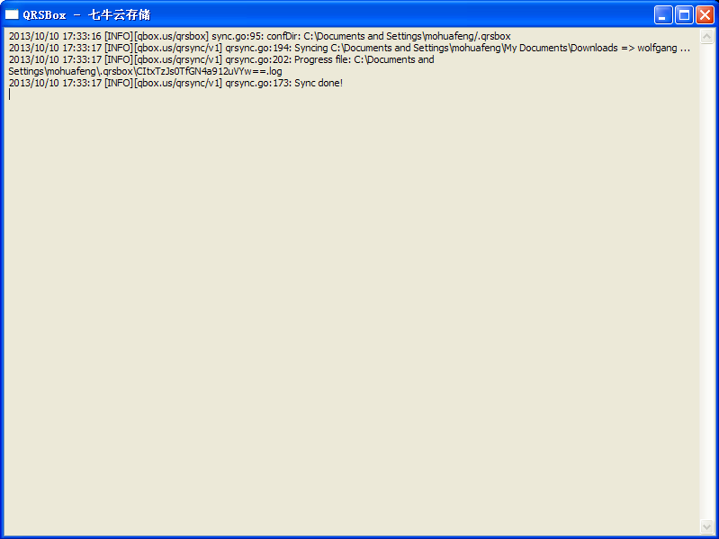

- [简介](#intro)
- [功能特性](#feature)
- [下载](#download)
- [使用方法](#usage)
    - [Windows图形工具的使用方法](#usage-gui)
    - [命令行工具使用方法](#usage-cmd)
- [故障排除](#failures)

<a id="intro"></a>

## 简介

QRSBox是七牛云存储提供的同步上传客户端工具，可以用于Linux、Mac OS X、Windows等操作系统。
使用QRSBox，可将用户本地某个目录的所有文件同步上传到七牛云存储中，同时监控目录变化，将目录中新增的文件也上传至七牛云存储。
配合操作系统已有的强大文件管理功能（分级存放、按指定项目排序、查找匹配指定条件的文件等），即可轻松优雅地完成繁复的文件管理事务。

请注意QRSBox不会同步文件的删除操作。也就是说，如果受监控的目录中有文件被删除，已上传至七牛云存储的文件副本仍旧保留。如果用户确实需要删除该文件，可以到[七牛管理控制台](https://portal.qiniu.com/) 中删除。这一设计的目的是为了防止误删文件造成数据丢失。同时还可以收获另一个好处，就是同步上传完一个文件后，本地可以马上删除该文件以释放磁盘空间。

关于QRSBox的一些疑问，可以在[疑问简答](http://kb.qiniu.com/537ps105)中找到答案。

<a id="feature"></a>

## 功能特性

- 支持配置文件；
- 支持大文件上传；
- 支持增量部分同步更新；
- 支持在后台运行、监控。

<a id="download"></a>

## 下载

- 图形化工具：
    - Windows: [qrsbox windows_386](http://devtools.qiniu.io/qiniu-devtools-windows_386-current.zip)

- 命令行工具：
    - Mac OS X: [qrsboxcli darwin_amd64](http://devtools.qiniu.io/qiniu-devtools-darwin_amd64-current.tar.gz)
    - Linux 64bits: [qrsboxcli linux_amd64](http://devtools.qiniu.io/qiniu-devtools-linux_amd64-current.tar.gz)
    - Linux 32bits: [qrsboxcli linux_386](http://devtools.qiniu.io/qiniu-devtools-linux_386-current.tar.gz)

---

<a id="usage"></a>

## QRSBox使用方法

QRSBox包含 Windows GUI 和 命令行工具两部分。前者可在 Windows中使用，由于拥有GUI界面，使用更加方便。后者适合 Linux/OS X 等类 Unix 操作系统使用。当然，命令行工具也有 Windows 版，可在 Windows 的命令行使用。

<a id="usage-gui"></a>

### Windows图形工具的使用方法

首先，下载 QRSBox 的 Windows GUI，并解压。

然后，在资源管理器中，进入解压后的文件，双击qrsbox.exe，弹出如下图所求的界面：

<div class="imgwrap"></div>

其中，`access_key` 和 `secret_key` 在七牛云存储平台上申请。步骤如下：

1. [开通七牛开发者帐号](https://portal.qiniu.com/signup)
1. [登录七牛开发者自助平台，查看 Access Key 和 Secret Key](https://portal.qiniu.com/setting/key)

`同步源目录` 是本地需要上传的目录，绝对路径完整表示。这个目录中的所有内容会被同步到指定的 `bucket` 上。注意：Windows 平台上路径的表示格式为：`盘符:/目录`，比如 E 盘下的目录 data 表示为：`e:/data` 。

`空间名(bucket)` 是你在七牛云存储上希望保存数据的 Bucket 名（类似于数据库的表），这个自己选择一个合适的就可以，要求是只能由字母、数字、下划线等组成。

完成这些设置后，点击确认，QRSBox 便会开始进行初始化。初始化完成后，就开始文件的同步。用户可以在qrsbox的界面上看到同步的进程，大致如下图所示：



随着文件同步的进行，用户可以在[开发者平台](https://portal.qiniu.com/)的空间管理中看到已上传的文件。

QRSBox 启动后会常驻内存，在 Windows 的任务栏中显示托盘  。

如果用户需要修改同步目录，AccessKey/SecretKey，或其他参数，可以右键单击qrsbox的托盘，选择“配置”菜单项，打开配置界面，重新配置。

<a id="usage-cmd"></a>

### 命令行工具使用方法

首先，下载 QRSBox 命令行工具，并解压。

然后，在解压后的文件夹中执行以下命令，进行初始化：

```
    ./qrsboxcli init <AccessKey> <SecretKey> <SyncDir> <Bucket> [<KeyPrefix>]
```

其中，`<AccessKey>` 和 `<SecretKey>` 在七牛云存储平台上申请。步骤如下：

1. [开通七牛开发者帐号](https://portal.qiniu.com/signup)
1. [登录七牛开发者自助平台，查看 Access Key 和 Secret Key](https://portal.qiniu.com/setting/key)

`<SyncDir>` 是本地的同步目录，该目录下的文件会随时同步上传值七牛云存储。

`<Bucket>` 是保存同步文件的[资源空间](http://docs.qiniu.com/api/v6/terminology.html#Bucket)名。

`<KeyPrefix>` 是文件前缀，可选。如果设置了该参数，那么上传的文件名前都会加上前缀。这个前缀主要用于在空间中区分不同上传来源的文件。

最后，用户可以使用以下命令开始文件同步：

```
./qrsboxcli sync &
```

这里使用了 `&` 符号，让同步客户端进程运行在后台。如果退出终端后程序中断，请使用以下命令代替：

```
nohup ./qrsboxcli sync >/dev/null 2>&1 &
```

用户可以通过以下命令查看同步过程：

```
./qrsboxcli log
```

如果需要停止后台运行的qrsboxcli，可以使用如下命令：

```
./qrsboxcli stop
```

如果希望改变同步的目录、bucket等运行参数，需要先用 `stop` 命令停止 qrsboxcli 的后台程序，重新用新的参数运行初始化命令，然后再次启动同步程序，qrsboxcli会立刻按新的配置将新目录的文件同步至七牛云存储。

#### 命令使用说明

执行以下命令可以获得各个子命令的使用说明：

```
./qrsboxcli

Usage:
  qrsboxcli init <AccessKey> <SecretKey> <SyncDir> <Bucket>  - Init qrsbox conf
  qrsboxcli sync &                                           - Watch <SyncDir> and sync files
  qrsboxcli log                                              - View sync log
  qrsboxcli stop                                             - Kill qrsboxcli sync process

BuildVersion:
  qrsboxcli v2.5.20131013
```

#### 配置文件

命令行工具的配置文件通常保存在用户主目录的.qrsbox下，执行init命令时会将具体目录路径输出到屏幕上。
具体内容如下（JSON格式）：

```
{
    "tasks": [
        {
            "src": "<SyncDir>",
            "dest": "qiniu:bucket=<Bucket>",
            "skipsym": 0,
            "syncdur": 0
        }
    ],
    "access_key": "<AccessKey>",
    "secret_key": "<SecretKey>",
    "debug_level": 0
}
```

其中，

- `tasks`字段指定监控任务：
    - `src`字段指定受监控的文件目录；
    - `dest`字段指定上传目标参数，如空间名（<Bucket>）和文件前缀（KeyPrefix），多个参数须以`&`符号分隔；
    - `skipsym`字段指定是否跳过链接文件，`0`表示不跳过，`1`表示跳过；
    - `syncdur`字段指定监控检测周期，单位为秒，`0`表示使用默认值（0.5秒）。
- `access_key`字段指定AccessKey值；
- `secret_key`字段指定SecretKey值；
- `debug_level`字段指定日志信息输出等级，默认值为`0`，即输出Debug信息。

---

<a id="failures">
## 故障排除

### Linux环境

1. `No space left on device`问题

现象为日志中出现如下错误：

```
2014/02/21 10:24:50 [ERROR][github.com/qiniu/fsw] utils.go:22: Watcher failed: no space left on device
```

遇到此问题，请先执行如下两行命令检查内核参数和监视文件数量：

```
cat /proc/sys/fs/inotify/max_user_watches

find <受监视文件夹路径> | wc -l
```

如果cat输出值小于wc输出值，则执行如下命令（设定值为`wc输出值 X 2`）：

```
echo 设定值 > /proc/sys/fs/inotify/max_user_watches
```
